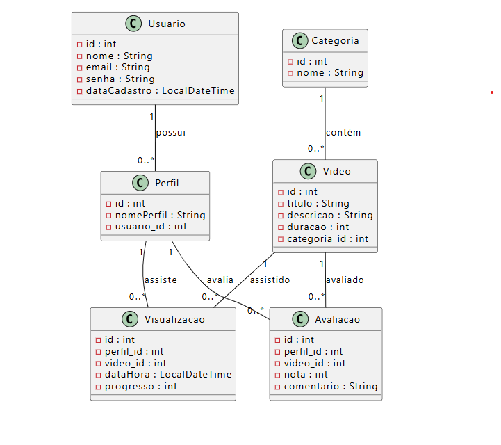

# Sistema de Streaming - JPA / Spring Data

Projeto desenvolvido para disciplina de POO com uso de **Spring Data JPA**.  
O sistema simula uma plataforma de **streaming de vídeos**, com cadastro de usuários, perfis, vídeos, categorias, visualizações e avaliações.

---

## Funcionalidades
- Cadastro de **Usuários** e **Perfis**
- Cadastro de **Vídeos** e **Categorias**
- Registro de **Visualizações** (progresso, data/hora)
- Registro de **Avaliações** (nota e comentário)
- Consultas via Query Methods:
  - Buscar vídeos pelo título com ordenação
  - Listar todos os vídeos de uma categoria ordenados pelo título
  - Listar os **Top 10 vídeos mais bem avaliados**
  - Listar os **Top 10 vídeos mais assistidos**
  - Retornar o **usuário que mais assistiu vídeos**

---

## Diagrama de Classe UML

